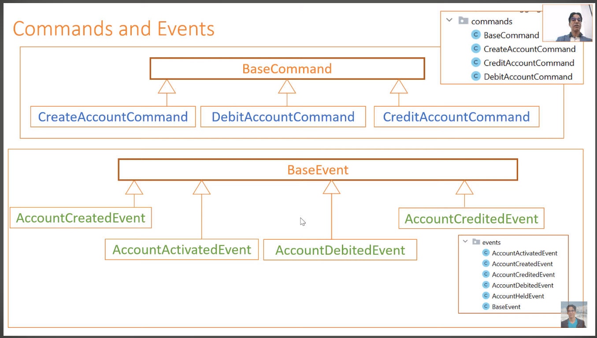

# event_driven_architecture_cqrs_and_event_sourcing

# Objectif 

> Create an application that allows for managing accounts in accordance with the CQRS and Event 
> Sourcing patterns using the AXON and Spring Boot frameworks

# POC (Proof of concept)

- Axon framework : https://docs.axoniq.io/reference-guide/v/4.0/

# Practical Demo


## Dependencies 

```xml
<dependencies>
        <dependency>
            <groupId>org.springframework.boot</groupId>
            <artifactId>spring-boot-starter-data-jpa</artifactId>
        </dependency>
        <dependency>
            <groupId>org.springframework.boot</groupId>
            <artifactId>spring-boot-starter-web</artifactId>
        </dependency>

        <dependency>
            <groupId>com.mysql</groupId>
            <artifactId>mysql-connector-j</artifactId>
            <scope>runtime</scope>
        </dependency>
        <dependency>
            <groupId>org.projectlombok</groupId>
            <artifactId>lombok</artifactId>
            <optional>true</optional>
        </dependency>
        <dependency>
            <groupId>org.springframework.boot</groupId>
            <artifactId>spring-boot-starter-test</artifactId>
            <scope>test</scope>
        </dependency>

    </dependencies>

```

- Axon framework dependency 

```xml
<!-- axon framework -->
<dependency>
    <groupId>org.axonframework</groupId>
    <artifactId>axon-spring-boot-starter</artifactId>
    <version>4.6.1</version>
    <exclusions>
        <exclusion>
            <groupId>org.axonframework</groupId>
            <artifactId>axon-server-connector</artifactId>
        </exclusion>
    </exclusions>
</dependency>
```

- Why `exclusion` ?

<pre>
Since Maven resolves dependencies transitively, it is possible for unwanted dependencies to be 
included in your project's classpath. For example, a certain older jar may have security issues or 
be incompatible with the Java version you're using. To address this, Maven allows you to exclude 
specific dependencies. Exclusions are set on a specific dependency in your POM, and are targeted 
at a specific groupId and artifactId. When you build your project, that artifact will not be added 
to your project's classpath by way of the dependency in which the exclusion was declared.
</pre>
- https://maven.apache.org/guides/introduction/introduction-to-optional-and-excludes-dependencies.html#how-to-use-dependency-exclusions 

- In this case we do not want `axon-server-connector`, by default we will use inMemory Axon server, we will not use a broker in this test or a server, that is why we excluded the server_connector.
- So our application will not search for a server to connect. it will use inMemory connection Bus.

- Axon arrives with a buitin broker.

## Properties 

```properties
spring.application.name= account-service
server.port= 8081

spring.datasource.url= jdbc:mysql://${MYSQL_HOST:localhost}:${MYSQL_PORT:3306}/accounts?createDatabaseIfNotExist=true
spring.datasource.username=${MYSQL_USERNAME:root}
spring.datasource.password=${MYSQL_PASSWORD:}

spring.jpa.hibernate.ddl-auto=update
spring.jpa.properties.hibernate.dialect= org.hibernate.dialect.MariaDbDialect
```

- We used `Env` variables like `MYSQL_HOST` to make it easear for us to inject them in the `DockerFile`.
- In this case spring well use the variable value if it is defined, and the default value `localhost` if not. 

## Creating the Commands & Events



- The events and commands are common between all the app micro-services.
- So as they are common, we can create them in a separated module. to be used from anywhere.
- In this case will not do that, we will just use packages because we have 1 micro-service.

### Commands
- Hold the functional need of the application (Besoin fonctionel).

- BaseCommand
```Java
package me.elaamiri.accountcqrseventsourcing.common_api.commands;

public abstract class BaseCommand<IDType> {
    @TargetAggregateIdentifier
    // the command ID is the identifier that will be used in the
    // Aggregate

    @Getter // because the commands are immutable objects
    // So we will not have the setters
    // Just a constructor for initializing
    private IDType id;

    public BaseCommand(IDType id) {
        this.id = id;
    }   
}
```

- CreateAccountCommand
```Java
package me.elaamiri.accountcqrseventsourcing.common_api.commands;

public class CreateAccountCommand extends BaseCommand<String>{

    private double initialBalance;
    private String currency;

    public CreateAccountCommand(String id, double initialBalance, String currency) {
        super(id);
        this.initialBalance = initialBalance;
        this.currency = currency;
    }

}

```

- DebitAccountCommand
```Java
package me.elaamiri.accountcqrseventsourcing.common_api.commands;

public class DebitAccountCommand extends BaseCommand<String>{

    private double amount;
    private String currency;

    public DebitAccountCommand(String id, double amount, String currency) {
        super(id);
        this.amount = amount;
        this.currency = currency;
    }
}


```

- CreditAccountCommand
```Java
package me.elaamiri.accountcqrseventsourcing.common_api.commands;

public class CreditAccountCommand extends BaseCommand<String>{
    private double amount;
    private String currency;

    public CreditAccountCommand(String id, double amount, String currency) {
        super(id);
        this.amount = amount;
        this.currency = currency;
    }
}

```

### Lets create some controllers

- Commands and query, should have Controllers both.
- So we will have controllers for the reading part (Query), and others for writing (Commands).

#### Commands Controllers

- AccountCommandController
```java
package me.elaamiri.accountcqrseventsourcing.common_api.controllers;
// ...
@RestController
@RequestMapping(path = "/commands/account")
@AllArgsConstructor
public class AccountCommandController {

    private CommandGateway commandGateway;

    @RequestMapping("/create")
    public CompletableFuture<String> createAccount(@RequestBody CreatAccountRequestDTO request){
        //
        CompletableFuture<String> createAccountCommandResponse = commandGateway.send(new CreateAccountCommand(
                UUID.randomUUID().toString(),
                request.getInitialBalance(),
                request.getCurrency()
        ));

        return createAccountCommandResponse;
    }
}

```
- 

```java
package me.elaamiri.accountcqrseventsourcing.common_api.dtos;
// ...
@Data @AllArgsConstructor @NoArgsConstructor
public class CreatAccountRequestDTO {
    private double initialBalance;
    private String currency;

}

```

38 v1