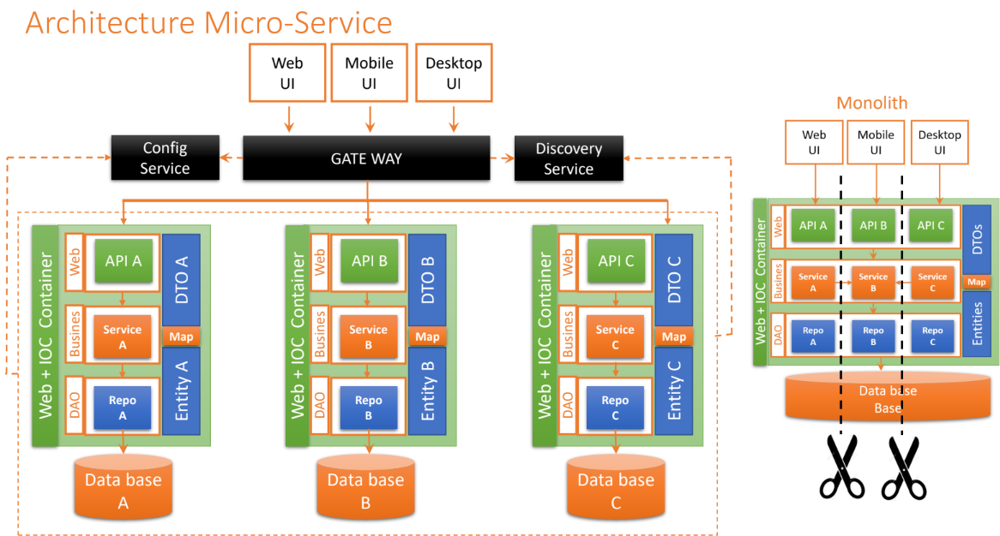
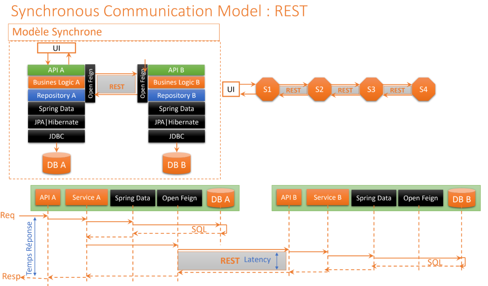
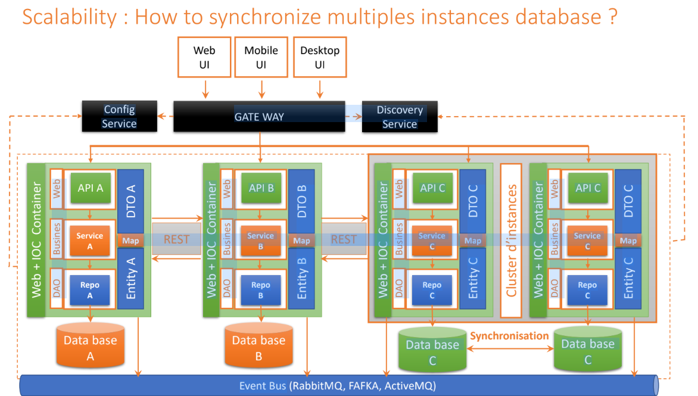
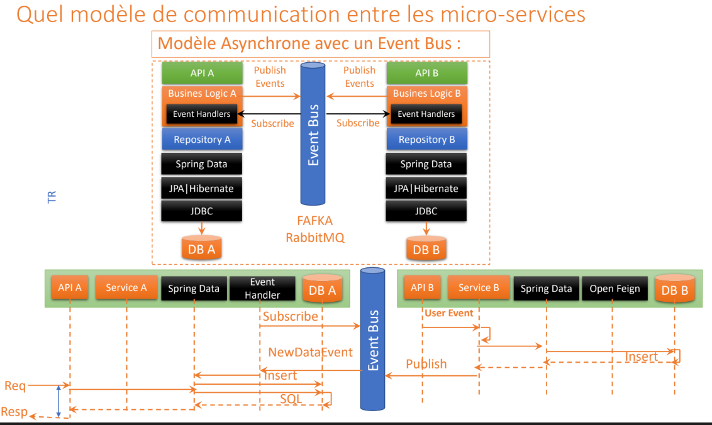
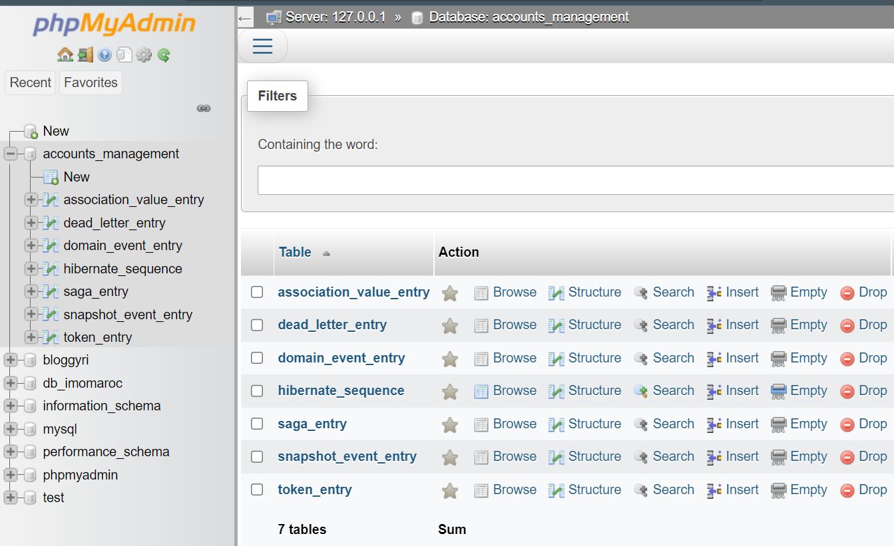

<!-- vscode-markdown-toc -->
* [Dependencies](#Dependencies)
* [Properties](#Properties)
* [creating the Commands & Events](#creatingtheCommandsEvents)
	* [Commands](#Commands)
	* [Lets create some controllers](#Letscreatesomecontrollers)
		* [Commands Controllers](#CommandsControllers)
		* [testing our App](#testingourApp)
		* [testing with http](#testingwithhttp)
	* [Adding events](#Addingevents)
	* [Adding Aggregate](#AddingAggregate)
	* [Adding and Endpoint to consult our eventStore](#AddingandEndpointtoconsultoureventStore)
	* [Activate an Account Event](#ActivateanAccountEvent)
* [Credit an account](#Creditanaccount)
* [Debit an account](#Debitanaccount)
* [Query Entities](#QueryEntities)
* [Query Repositories](#QueryRepositories)
* [Query Services](#QueryServices)
* [Queries](#Queries)
* [QueyHandler in the Service](#QueyHandlerintheService)
* [Query Controllers](#QueryControllers)
* [Testing our Query controller](#TestingourQuerycontroller)
	* [Create  query controller method proccess](#Createquerycontrollermethodproccess)

<!-- vscode-markdown-toc-config
	numbering=false
	autoSave=true
	/vscode-markdown-toc-config -->
<!-- /vscode-markdown-toc -->


# event_driven_architecture_cqrs_and_event_sourcing

- A micro-services architecture based on CQRS and event Sourcing with Spring Cloud and AXON.

# Objectif 

> Create an application that allows for managing accounts in accordance with the CQRS and Event 
> Sourcing patterns using the AXON and Spring Boot frameworks

# POC (Proof of concept)

- **Micro-services** : An Architecture where we separate our application to many micro-application, with independents databases ...
- We are using **Spring Claoud** framework for that. 
- This architecture uses some technical tools or (Micro-services):
    - Gate way 
    - Discovery Service 
    - Config Server.. 
     
- The communication between the **Micro-services** can be **synchronouse** or **Asynchronouse**.
1. **Synchronouse** with Rest | Spring Cloud , OpenFeign | JRPC
    - Piple line of communication => Communication bloquante, affect the performance
    - The communication depends on the other micro-services connection.
    - In case of horisontal scalability, and we added an instance of a service, the two should be have a synchronized databases?? 
    -  ==> So we will need to use **Event Bus** and **Brokers**.
    - As a solution some architecte may choose to centralize the data in a single database, but that is not recommanded, as we have other solutions 







- **Asynchronouse** : All the commnunications in the architecture will use the **Event Bus**
    - It is an event driven architecture.
    - A microservice Subscribes in the Event Bus, and if there is a change happened in the other 
    microservice, it will publish it, so the first can handle it with out explicite communication 
    between them using Rest.




- We can talk about **Event  bus** like a **Telegram channel**, where we subscribe and if there is a message (event), we can use it then (Act).

## Event Sourcing

### What is it ?

- It is a Pattern architecture (Strategic) [The others are called tactic ex. Adapter, Sigleton ...].
- Used to implement this kind of Architecture (Even driven arch).
- In the implementation we use actually 2 famous patterns (CQRS & Event Sourcing).
- **Role**: :fire: rack all changes in the state of an application as a sequence of events [Event Store].
- The objective is to do not focus on the current state of the application, but on the sequence of state changes (business events) that led to the current state.
- From this sequence of events, we can aggregate the current state of the application.
- Every change in the state of the application has a unique cause (event). 
- For example: operations performed on a bank account (CREATED, ACTIVATED, CREDITED, DEBITED ...).
- All the events are stored in a single database table, it is :fire: **Event store**.
- This gives us the possiblity to return to an exact state and the history of our app.

### Advantages.
- Its privide an **Audit base** (Database).
- **Analysis and Debug**: Easily find the source of production bugs.
- **Data recovery**: In case of a failure (Panne), replay all recorded business events to find the state of the application.
- **Performance**: Asynchronous with message buses that scale well.
- From the events, we can create multiple projections with different data models.

### Event sourcing Achitecture and Terminology
- More info: https://microservices.io/patterns/data/event-sourcing.html

#### Command 
- External solitation (Request, Demmad) to the system.
- Changes the system (Creat, Update, Delete ...).
- Each command arrives => invokes (déclenche) a **Decison function** (Fonction de décision) which is the Business logic [`Command Handler` => Command listener].

#### Decison function
- It is the businness logic 
- Invoked when a command accures 
- It is `Command Handler` which means it is a command listener.
- (Actual state, Command) => List[Event]
- This list of events will be stored to the `Event Store`

#### Event 
- The fact that they were produced in the recent past (ex. AccountCreatedEvent)
- They are Immutable : can not be changed or modified (It is past...No stters allowed)
- The are auto Descriptive : We do not have to go to other to understand its functionnality.

#### Event Store
- Database that stores all the events emmited by the **decision function**.


## CQRS 

- Axon framework : https://docs.axoniq.io/reference-guide/v/4.0/

- CQRS stands for **Command Query Responsibility Segregation**.

<pre>
The change that CQRS introduces is to split that conceptual model into separate models for update and display, 
which it refers to as Command and Query respectively following the vocabulary of CommandQuerySeparation. 
The rationale is that for many problems, particularly in more complicated domains, having the same conceptual model for commands and queries leads to a more complex model that does neither well.
</pre>


# Practical Demo


## <a name='Dependencies'></a>Dependencies 

```xml
<dependencies>
        <dependency>
            <groupId>org.springframework.boot</groupId>
            <artifactId>spring-boot-starter-data-jpa</artifactId>
        </dependency>
        <dependency>
            <groupId>org.springframework.boot</groupId>
            <artifactId>spring-boot-starter-web</artifactId>
        </dependency>

        <dependency>
            <groupId>com.mysql</groupId>
            <artifactId>mysql-connector-j</artifactId>
            <scope>runtime</scope>
        </dependency>
        <dependency>
            <groupId>org.projectlombok</groupId>
            <artifactId>lombok</artifactId>
            <optional>true</optional>
        </dependency>
        <dependency>
            <groupId>org.springframework.boot</groupId>
            <artifactId>spring-boot-starter-test</artifactId>
            <scope>test</scope>
        </dependency>

    </dependencies>

```

- Axon framework dependency 

```xml
<!-- axon framework -->
<dependency>
    <groupId>org.axonframework</groupId>
    <artifactId>axon-spring-boot-starter</artifactId>
    <version>4.6.1</version>
    <exclusions>
        <exclusion>
            <groupId>org.axonframework</groupId>
            <artifactId>axon-server-connector</artifactId>
        </exclusion>
    </exclusions>
</dependency>
```

- Why `exclusion` ?

<pre>
Since Maven resolves dependencies transitively, it is possible for unwanted dependencies to be 
included in your project's classpath. For example, a certain older jar may have security issues or 
be incompatible with the Java version you're using. To address this, Maven allows you to exclude 
specific dependencies. Exclusions are set on a specific dependency in your POM, and are targeted 
at a specific groupId and artifactId. When you build your project, that artifact will not be added 
to your project's classpath by way of the dependency in which the exclusion was declared.
</pre>
- https://maven.apache.org/guides/introduction/introduction-to-optional-and-excludes-dependencies.html#how-to-use-dependency-exclusions 

- In this case we do not want `axon-server-connector`, by default we will use inMemory Axon server, we will not use a broker in this test or a server, that is why we excluded the server_connector.
- So our application will not search for a server to connect. it will use inMemory connection Bus.

- Axon arrives with a buitin broker.

## <a name='Properties'></a>Properties 

```properties
spring.application.name= account-service
server.port= 8081

spring.datasource.url= jdbc:mysql://${MYSQL_HOST:localhost}:${MYSQL_PORT:3306}/accounts?createDatabaseIfNotExist=true
spring.datasource.username=${MYSQL_USERNAME:root}
spring.datasource.password=${MYSQL_PASSWORD:}

spring.jpa.hibernate.ddl-auto=update
spring.jpa.properties.hibernate.dialect= org.hibernate.dialect.MariaDBDialect
```

- We used `Env` variables like `MYSQL_HOST` to make it easear for us to inject them in the `Docker compose` file.
- In this case spring well use the variable value if it is defined, and the default value `localhost` if not. 


## <a name='creatingtheCommandsEvents'></a>creating the Commands & Events


- The events and commands are common between all the app micro-services.
- So as they are common, we can create them in a separated module. to be used from anywhere.
- In this case will not do that, we will just use packages because we have 1 micro-service.

### <a name='Commands'></a>Commands
- Hold the functional need of the application (Besoin fonctionel).

- BaseCommand
```Java
package me.elaamiri.accountcqrseventsourcing.common_api.commands;

public abstract class BaseCommand<IDType> {
    @TargetAggregateIdentifier
    // the command ID is the identifier that will be used in the
    // Aggregate

    @Getter // because the commands are immutable objects
    // So we will not have the setters
    // Just a constructor for initializing
    private IDType id;

    public BaseCommand(IDType id) {
        this.id = id;
    }   
}
```

- CreateAccountCommand
```Java
package me.elaamiri.accountcqrseventsourcing.common_api.commands;

public class CreateAccountCommand extends BaseCommand<String>{

    private double initialBalance;
    private String currency;

    public CreateAccountCommand(String id, double initialBalance, String currency) {
        super(id);
        this.initialBalance = initialBalance;
        this.currency = currency;
    }

}

```

- DebitAccountCommand
```Java
package me.elaamiri.accountcqrseventsourcing.common_api.commands;

public class DebitAccountCommand extends BaseCommand<String>{

    private double amount;
    private String currency;

    public DebitAccountCommand(String id, double amount, String currency) {
        super(id);
        this.amount = amount;
        this.currency = currency;
    }
}


```

- CreditAccountCommand
```Java
package me.elaamiri.accountcqrseventsourcing.common_api.commands;

public class CreditAccountCommand extends BaseCommand<String>{
    private double amount;
    private String currency;

    public CreditAccountCommand(String id, double amount, String currency) {
        super(id);
        this.amount = amount;
        this.currency = currency;
    }
}

```

### <a name='Letscreatesomecontrollers'></a>Lets create some controllers

- Commands and query, should have Controllers both.
- So we will have controllers for the reading part (Query), and others for writing (Commands).

#### <a name='CommandsControllers'></a>Commands Controllers

- AccountCommandController
```java
package me.elaamiri.accountcqrseventsourcing.common_api.controllers;
// ...
@RestController
@RequestMapping(path = "/commands/account")
@AllArgsConstructor
public class AccountCommandController {

    private CommandGateway commandGateway;

    @RequestMapping("/create")
    public CompletableFuture<String> createAccount(@RequestBody CreatAccountRequestDTO request){
        //
        CompletableFuture<String> createAccountCommandResponse = commandGateway.send(new CreateAccountCommand(
                UUID.randomUUID().toString(),
                request.getInitialBalance(),
                request.getCurrency()
        ));

        return createAccountCommandResponse;
    }
}

```
- 

```java
package me.elaamiri.accountcqrseventsourcing.common_api.dtos;
// ...
@Data @AllArgsConstructor @NoArgsConstructor
public class CreatAccountRequestDTO {
    private double initialBalance;
    private String currency;

}

```

#### <a name='testingourApp'></a>testing our App

- Run our App

- Output

```yaml
***************************
APPLICATION FAILED TO START
***************************

Description:

Parameter 0 of constructor in me.elaamiri.accountcqrseventsourcing.common_api.controllers.AccountCommandController required a bean of type 'org.axonframework.commandhandling.gateway.CommandGateway' that could not be found.


Action:

Consider defining a bean of type 'org.axonframework.commandhandling.gateway.CommandGateway' in your configuration.


Process finished with exit code 1

```

- If There anther exception, check if it is related to the versions compatibility between `Spring` and `Axon`.

- **Solution**: :fire: adding `@NoArgsConstructor` (public default constructor) with `@AllArgsConstructor` in top of the class. :x:Will discover that it is just a temporary solution that produces another problem -> NullPointerException:x:

- **Result**: an empty database 
- **Expected**: have Axon related tables in the DB.
- **Problem**: Axon Framework doesn't work with Spring Boot 3 yet. 
- **Solution**: use `Spring 2.7.6` with `Axon 4.6.2`
- Here my DB 



#### <a name='testingwithhttp'></a>testing with http

```http
POST /commands/account/create HTTP/1.1
Host: localhost:8081
Content-Type: application/json
Content-Length: 61

{
    "initialBalance": 1500.2,
    "currency" : "MAD"

}
```

- Response

```res
HTTP/1.1 500 
Content-Type: application/json
Transfer-Encoding: chunked
Date: Mon, 19 Dec 2022 22:34:27 GMT
Connection: close

{
  "timestamp": "2022-12-19T22:34:27.121+00:00",
  "status": 500,
  "error": "Internal Server Error",
  "path": "/commands/account/create"
}
```

- **Exception**

```yml
java.lang.NullPointerException: Cannot invoke "org.axonframework.commandhandling.gateway.CommandGateway.send(Object)" because "this.commandGateway" is null
```
- The problem is that we do not have a handler : `No handler was subscribed to command ... CreateAcountCommand`.

- To get thing more clear we will add an exceptionHandler method to our Controller.


```java
@ExceptionHandler(Exception.class)
    public ResponseEntity<String> exceptionHandler(Exception exception){
        ResponseEntity<String> responseEntity = new ResponseEntity<>(
            exception.getMessage(), HttpStatus.INTERNAL_SERVER_ERROR
        );

        return responseEntity;
    }
```


- :fire: In fact the last Exception it was because I used the  `@NoArgsConstructor` (public default constructor).
- Now after removing it :

```yml
adding `@NoArgsConstructor` (public default constructor)
```

### <a name='Addingevents'></a>Adding events

```java
package me.elaamiri.accountcqrseventsourcing.common_api.events;

public abstract class BaseEvent<EventId> {
    @Getter
    private EventId id;

    public BaseEvent(EventId id){
        this.id = id;
    }

}

```

- AccountCreatedEvent

```java
package me.elaamiri.accountcqrseventsourcing.common_api.events;

public class AccountCreatedEvent extends BaseEvent<String>{

    @Getter
    private double initialBalance;
    @Getter
    private String currency;

    public AccountCreatedEvent(String id, double initialBalance, String currency) {
        super(id);
        this.initialBalance = initialBalance;
        this.currency = currency;
    }
}

```

### <a name='AddingAggregate'></a>Adding Aggregate

- In the Aggregate where we put our Business code.
- In the Aggregate we will create the CommandHandler.
- It is the status of our Object

```java
package me.elaamiri.accountcqrseventsourcing.commands.aggregates;

@Aggregate
//@NoArgsConstructor // Important
public class AccountAggregate {
    @AggregateIdentifier
    private String accountId; // identifies the aggregation
    // This id will be mapped to the TargetAggregateIdentifier in the baseCommand
    private double balance;
    private String currency;
    private AccountStatus status;

    public AccountAggregate(){
        // Required by Axon
    }

    @CommandHandler // Subscribe to Command Bus, and listen to the CreateAccountCommand events
    public AccountAggregate(CreateAccountCommand createAccountCommand){
        // Business logic

        if(createAccountCommand.getInitialBalance() < 0) throw new RuntimeException("Invalid Initial Balance | Negative");
        AggregateLifecycle.apply(new AccountCreatedEvent(
                // Command to event
                createAccountCommand.getId(),
                createAccountCommand.getInitialBalance(),
                createAccountCommand.getCurrency()
        ));
    }

    @EventSourcingHandler
    public void on(AccountCreatedEvent accountCreatedEvent){

        // The Aggregate is the Object Status
        this.accountId = accountCreatedEvent.getId();
        this.balance = accountCreatedEvent.getInitialBalance();
        this.currency = accountCreatedEvent.getCurrency();

        this.status = AccountStatus.CREATED;
    }

}

```

- Test

- Request 

```http
POST /commands/account/create HTTP/1.1
Host: localhost:8081
Content-Type: application/json
Content-Length: 61

{
    "initialBalance": 1500.2,
    "currency" : "MAD"

}
```

- Response 

```res
HTTP/1.1 200 
Content-Type: text/plain;charset=UTF-8
Content-Length: 36
Date: Mon, 19 Dec 2022 23:56:00 GMT
Connection: close

3696ac91-6749-482a-bb5e-16999e911758

```
- Account Created .
- We can see the 2 events in the `Event store` which is  the  `domain_event_entry` in the DB.


- It stors the the event content in the `meta_data` and `pyload` colomuns on Binary format (BLOB).
- We can show the data as `XML` via clicking on the row and the XML file starts being downloaded.
- Here is the Paload content file : [file](./external_files/domain_event_entry-payload.bin)

```xml
<me.elaamiri.accountcqrseventsourcing.common__api.events.AccountCreatedEvent>
   <id class="string">98862efc-d9c0-41bf-927b-8bec96f7d175</id>
   <initialBalance>1500.2</initialBalance>
   <currency>MAD</currency>
</me.elaamiri.accountcqrseventsourcing.common__api.events.AccountCreatedEvent>
```
- It is the event content.
- By default it saved by axon on XML format but we can choose to be JSON if we want.

### <a name='AddingandEndpointtoconsultoureventStore'></a>Adding and Endpoint to consult our eventStore
- Here is the controller 

```java
package me.elaamiri.accountcqrseventsourcing.commands.controllers;

@RestController
@RequestMapping(path = "/commands/account")
@AllArgsConstructor // for injection
//@NoArgsConstructor
public class AccountCommandController {

    private CommandGateway commandGateway;
    private EventStore eventStore;
    @RequestMapping("/create")
    public CompletableFuture<String> createAccount(@RequestBody CreatAccountRequestDTO request){
        //asynchronous
        CompletableFuture<String> createAccountCommandResponse = commandGateway.send(new CreateAccountCommand(
                UUID.randomUUID().toString(),
                request.getInitialBalance(),
                request.getCurrency()
        ));

        return createAccountCommandResponse;
    }

    @ExceptionHandler(Exception.class)
    public ResponseEntity<String> exceptionHandler(Exception exception){
        ResponseEntity<String> responseEntity = new ResponseEntity<>(
            exception.getMessage(), HttpStatus.INTERNAL_SERVER_ERROR
        );

        return responseEntity;
    }

    @GetMapping("/eventStore/{account_id}")
    /*
    Injected
        private EventStore eventStore;
     */
    public Stream eventStore(@PathVariable String account_id){
        return eventStore.readEvents(account_id).asStream();
    }
}

```

- Testing it: with the id of the account we have created

```http
GET /commands/account/eventStore/98862efc-d9c0-41bf-927b-8bec96f7d175 HTTP/1.1
Host: localhost:8081
```
- Response

```res
HTTP/1.1 200 
Content-Type: application/json
Transfer-Encoding: chunked
Date: Fri, 23 Dec 2022 04:39:32 GMT
Connection: close

[
  {
    "type": "AccountAggregate",
    "aggregateIdentifier": "98862efc-d9c0-41bf-927b-8bec96f7d175",
    "sequenceNumber": 0,
    "timestamp": "2022-12-19T23:55:34.698Z",
    "identifier": "59003f30-ecdb-4199-be49-d127573d3592",
    "payload": {
      "id": "98862efc-d9c0-41bf-927b-8bec96f7d175",
      "initialBalance": 1500.2,
      "currency": "MAD"
    },
    "payloadType": "me.elaamiri.accountcqrseventsourcing.common_api.events.AccountCreatedEvent",
    "metaData": {
      "traceId": "94ecc849-aa3c-4310-ab19-200a478326d4",
      "correlationId": "94ecc849-aa3c-4310-ab19-200a478326d4"
    }
  }
]

```

### <a name='ActivateanAccountEvent'></a>Activate an Account Event 

- We have created CreateAccount Event let's create `Activate Account Event`.

```java
package me.elaamiri.accountcqrseventsourcing.common_api.events;
public class AccountActivatedEvent  extends BaseEvent<String> {
    private AccountStatus accountStatus;

    public AccountActivatedEvent(String s, AccountStatus accountStatus) {
        super(s);
        this.accountStatus = accountStatus;
    }
}

```

- In the `aggregate` (``) we add the event, after the account creation.

- How the aggregate becomes 

```java
package me.elaamiri.accountcqrseventsourcing.commands.aggregates;

@Aggregate
//@NoArgsConstructor // Important
public class AccountAggregate {
    @AggregateIdentifier
    private String accountId; // identifies the aggregation
    // This id will be mapped to the TargetAggregateIdentifier in the baseCommand
    private double balance;
    private String currency;
    private AccountStatus status;

    public AccountAggregate(){
        // Required by Axon
    }

    @CommandHandler // Subscribe to Command Bus, and listen to the CreateAccountCommand events
    public AccountAggregate(CreateAccountCommand createAccountCommand){
        // Business logic

        if(createAccountCommand.getInitialBalance() < 0) throw new RuntimeException("Invalid Initial Balance | Negative");
        AggregateLifecycle.apply(new AccountCreatedEvent(
                // Command to event
                createAccountCommand.getId(),
                createAccountCommand.getInitialBalance(),
                createAccountCommand.getCurrency()
        ));
    }

    @EventSourcingHandler
    public void on(AccountCreatedEvent accountCreatedEvent){

        // The Aggregate is the Object Status
        this.accountId = accountCreatedEvent.getId();
        this.balance = accountCreatedEvent.getInitialBalance();
        this.currency = accountCreatedEvent.getCurrency();

        this.status = AccountStatus.CREATED;
        // here we added the AccountActivatedEvent event 
        AggregateLifecycle.apply(new AccountActivatedEvent(accountCreatedEvent.getId(), AccountStatus.ACTIVATED));
    }

    // create an on() function for our event
    // Here we added the event sourcing handler for the event where we change the aggregate status
    @EventSourcingHandler // Changing the aggregate status
    public void on(AccountActivatedEvent accountActivatedEvent){
        this.status = accountActivatedEvent.getAccountStatus();
    }

}

```

- Testing this 
- We create a new account now, and consult its event store => 2 events

```http
GET /commands/account/eventStore/b6541e22-9307-4005-86da-cde22d2c583e HTTP/1.1
Host: localhost:8081
```
- Response 

```res
HTTP/1.1 200 
Content-Type: application/json
Transfer-Encoding: chunked
Date: Fri, 23 Dec 2022 04:54:48 GMT
Connection: close

[
  {
    "type": "AccountAggregate",
    "aggregateIdentifier": "b6541e22-9307-4005-86da-cde22d2c583e",
    "sequenceNumber": 0,
    "timestamp": "2022-12-23T04:54:16.720Z",
    "identifier": "109c98c9-f437-42dd-b1d3-fff20b4fbcdd",
    "payload": {
      "id": "b6541e22-9307-4005-86da-cde22d2c583e",
      "initialBalance": 56200.2,
      "currency": "MAD"
    },
    "payloadType": "me.elaamiri.accountcqrseventsourcing.common_api.events.AccountCreatedEvent",
    "metaData": {
      "traceId": "b289bb24-5741-4eac-a386-9fd778b24303",
      "correlationId": "b289bb24-5741-4eac-a386-9fd778b24303"
    }
  },
  {
    "type": "AccountAggregate",
    "aggregateIdentifier": "b6541e22-9307-4005-86da-cde22d2c583e",
    "sequenceNumber": 1,
    "timestamp": "2022-12-23T04:54:16.724Z",
    "identifier": "1064c497-9111-4726-84eb-3288128f0c77",
    "payload": {
      "id": "b6541e22-9307-4005-86da-cde22d2c583e",
      "accountStatus": "ACTIVATED"
    },
    "payloadType": "me.elaamiri.accountcqrseventsourcing.common_api.events.AccountActivatedEvent",
    "metaData": {
      "traceId": "b289bb24-5741-4eac-a386-9fd778b24303",
      "correlationId": "b289bb24-5741-4eac-a386-9fd778b24303"
    }
  }
]

```

- That's all about the `Command` part, still the `UI` part.

----------------------------------

:o::o::o::o::o::o::o::o::o::o::o::o::o::o::o::o::o::o::o::o::o::o::o::o::o::o::o::o::o::o::o::o::o::o::o::o::o::o::o::o::o::o::o::o::o::o::o::o:

## <a name='Creditanaccount'></a>Credit an account 

- **Create the Command (`CreditAccountCommand`)**

```java
package me.elaamiri.accountcqrseventsourcing.common_api.commands;
public class CreditAccountCommand extends BaseCommand<String>{
    @Getter
    private double amount;
    @Getter
    private String currency;

    public CreditAccountCommand(String id, double amount, String currency) {
        super(id);
        this.amount = amount;
        this.currency = currency;
    }
}

```

- **Create the event (`AccountCredtedEvent`)**

```java
package me.elaamiri.accountcqrseventsourcing.common_api.events;

public class AccountCreditedEvent extends BaseEvent<String>{

    @Getter
    private double amount;
    @Getter
    private double currency;

    public AccountCreditedEvent(String s, double amount, double currency) {
        super(s);
        this.amount = amount;
        this.currency = currency;
    }
}

```

- **Adding the methods that triggers (calls | déclancher) the Command|event in the controller** 
- We will use a `@PutMapping` because we will update account status ...
```java
 @PutMapping("/credit")
    public CompletableFuture<String> creditAccount(@RequestBody CreditAccountRequestDTO creditAccountRequestDTO){
        CompletableFuture<String> creditAccountCommandResponse = commandGateway.send(new CreditAccountCommand(
                creditAccountRequestDTO.getAccountId(),
                creditAccountRequestDTO.getAmount(),
                creditAccountRequestDTO.getCurrency()
        ));

        return creditAccountCommandResponse;
    }
```

- **Creating the DTO needed for that** 
- To do a credit we need the account ID
```java
package me.elaamiri.accountcqrseventsourcing.common_api.dtos;
@Data
public class CreditAccountRequestDTO {
    private String accountId;
    private double amount;
    private String currency;
}

```

- **Creating the Aggregate CommandHandler** => **`Decision function`**
- It is a handler for the command (A listener).
- We will handle the command in our same Aggregate (`AccountAggregate`)

```java
 @CommandHandler // when the command will be sent to the Commands bus, this method will be invoked
    public void handle(CreditAccountCommand creditAccountCommand){
        // business logic
        if(creditAccountCommand.getAmount() <= 100) throw new InsufficientCreditAmount("Credit Amount can not be lower than 100.");
        // Business logic is fine ? SO
        // immetre un événement
        // immit an event
        AggregateLifecycle.apply(new AccountCreditdEvent(
                creditAccountCommand.getId(),
                creditAccountCommand.getAmount(),
                creditAccountCommand.getCurrency()
        ));
    }
```
- Now we should update the application state, (Apply the event)

- **Creating the Aggregate EventSourcingHandler**  => **`Evolution function`**

```java
@EventSourcingHandler
    public void on(AccountCreditedEvent accountCreditedEvent){
        this.balance += accountCreditedEvent.getAmount();
    }

```
- **Do not forget to handle Exceptions**

```java
package me.elaamiri.accountcqrseventsourcing.common_api.exceptions;

public class InsufficientCreditAmount extends RuntimeException {
    public InsufficientCreditAmount(String message) {
        super(message);
    }
}

```

- **Testing**

```http
PUT /commands/account/credit HTTP/1.1
Host: localhost:8081
Content-Type: application/json
Content-Length: 114

{
    
    "accountId": "ff75f615-21f8-4401-ba22-6234db93e2c5",
    "amount": 480,
    "currency" : "MAD"

}
```
- Response (Amount < 100)

```res
HTTP/1.1 500 
Content-Type: text/plain;charset=UTF-8
Content-Length: 40
Date: Fri, 23 Dec 2022 05:59:36 GMT
Connection: close

Credit Amount can not be lower than 100.
```
- Response (Amount > 100)

```res
HTTP/1.1 200 
Content-Length: 0
Date: Fri, 23 Dec 2022 06:00:48 GMT
Connection: close
```

- **Result**

<details>
<summary> Visiting Pyload: <small>`http://localhost:8081/commands/account/eventStore/ff75f615-21f8-4401-ba22-6234db93e2c5`</small> result</summary>

```json
[
    {
        "type": "AccountAggregate",
        "aggregateIdentifier": "ff75f615-21f8-4401-ba22-6234db93e2c5",
        "sequenceNumber": 0,
        "timestamp": "2022-12-23T05:58:09.017Z",
        "identifier": "4f3679fa-f5be-405c-8022-0811898f1387",
        "payload": {
            "id": "ff75f615-21f8-4401-ba22-6234db93e2c5",
            "initialBalance": 8000.2,
            "currency": "MAD"
        },
        "payloadType": "me.elaamiri.accountcqrseventsourcing.common_api.events.AccountCreatedEvent",
        "metaData": {
            "traceId": "d29c0be6-cdcf-481c-8873-1487f2e7acfd",
            "correlationId": "d29c0be6-cdcf-481c-8873-1487f2e7acfd"
        }
    },
    {
        "type": "AccountAggregate",
        "aggregateIdentifier": "ff75f615-21f8-4401-ba22-6234db93e2c5",
        "sequenceNumber": 1,
        "timestamp": "2022-12-23T05:58:09.018Z",
        "identifier": "7ae4a798-fa10-4037-8ebc-09ab7b1a1465",
        "payload": {
            "id": "ff75f615-21f8-4401-ba22-6234db93e2c5",
            "accountStatus": "ACTIVATED"
        },
        "payloadType": "me.elaamiri.accountcqrseventsourcing.common_api.events.AccountActivatedEvent",
        "metaData": {
            "traceId": "d29c0be6-cdcf-481c-8873-1487f2e7acfd",
            "correlationId": "d29c0be6-cdcf-481c-8873-1487f2e7acfd"
        }
    },
    {
        "type": "AccountAggregate",
        "aggregateIdentifier": "ff75f615-21f8-4401-ba22-6234db93e2c5",
        "sequenceNumber": 2,
        "timestamp": "2022-12-23T05:59:12.589Z",
        "identifier": "af894739-9812-424a-ab72-12780d01613c",
        "payload": {
            "id": "ff75f615-21f8-4401-ba22-6234db93e2c5",
            "initialBalance": 520.0,
            "currency": "MAD"
        },
        "payloadType": "me.elaamiri.accountcqrseventsourcing.common_api.events.AccountCreatedEvent",
        "metaData": {
            "traceId": "0719b1ba-1430-4e10-a3e3-842ffc19b8b4",
            "correlationId": "0719b1ba-1430-4e10-a3e3-842ffc19b8b4"
        }
    },
    {
        "type": "AccountAggregate",
        "aggregateIdentifier": "ff75f615-21f8-4401-ba22-6234db93e2c5",
        "sequenceNumber": 3,
        "timestamp": "2022-12-23T05:59:12.589Z",
        "identifier": "103060bd-e4d3-4d2a-bab2-6f82193ec52a",
        "payload": {
            "id": "ff75f615-21f8-4401-ba22-6234db93e2c5",
            "accountStatus": "ACTIVATED"
        },
        "payloadType": "me.elaamiri.accountcqrseventsourcing.common_api.events.AccountActivatedEvent",
        "metaData": {
            "traceId": "0719b1ba-1430-4e10-a3e3-842ffc19b8b4",
            "correlationId": "0719b1ba-1430-4e10-a3e3-842ffc19b8b4"
        }
    },
    {
        "type": "AccountAggregate",
        "aggregateIdentifier": "ff75f615-21f8-4401-ba22-6234db93e2c5",
        "sequenceNumber": 4,
        "timestamp": "2022-12-23T06:00:48.864Z",
        "identifier": "a9529b1f-854a-458a-b4bc-adeee804a04e",
        "payload": {
            "id": "ff75f615-21f8-4401-ba22-6234db93e2c5",
            "initialBalance": 480.0,
            "currency": "MAD"
        },
        "payloadType": "me.elaamiri.accountcqrseventsourcing.common_api.events.AccountCreatedEvent",
        "metaData": {
            "traceId": "2fbaf0bd-ed20-46bb-adb9-6b43bffcff9b",
            "correlationId": "2fbaf0bd-ed20-46bb-adb9-6b43bffcff9b"
        }
    },
    {
        "type": "AccountAggregate",
        "aggregateIdentifier": "ff75f615-21f8-4401-ba22-6234db93e2c5",
        "sequenceNumber": 5,
        "timestamp": "2022-12-23T06:00:48.864Z",
        "identifier": "d18d0eb1-0782-4046-b25e-d98ca9e0c482",
        "payload": {
            "id": "ff75f615-21f8-4401-ba22-6234db93e2c5",
            "accountStatus": "ACTIVATED"
        },
        "payloadType": "me.elaamiri.accountcqrseventsourcing.common_api.events.AccountActivatedEvent",
        "metaData": {
            "traceId": "2fbaf0bd-ed20-46bb-adb9-6b43bffcff9b",
            "correlationId": "2fbaf0bd-ed20-46bb-adb9-6b43bffcff9b"
        }
    }
]
```
</details>


## <a name='Debitanaccount'></a>Debit an account 
- *> In the same process
- Create the Command (`DebitAccountCommand`)
- Event  
- Controller method + RequestDTO (if needed)
- Aggregate Command Handler 
- Aggregate Event Sourcing Handler
- **Testing**

```http
PUT /commands/account/debit HTTP/1.1
Host: localhost:8081
Content-Type: application/json
Content-Length: 114

{
    
    "accountId": "a9e3557a-847e-4c9b-a40d-5b8c329e6777",
    "amount": 200.5,
    "currency" : "MAD"

}
```
- Response (amount < 0 )

```res
HTTP/1.1 500 
Content-Type: text/plain;charset=UTF-8
Content-Length: 24
Date: Fri, 23 Dec 2022 07:40:23 GMT
Connection: close

Amount can't be negative
```

- Response (amount > balance)

```res
HTTP/1.1 500 
Content-Type: text/plain;charset=UTF-8
Content-Length: 45
Date: Fri, 23 Dec 2022 07:42:56 GMT
Connection: close

Amount must be lower than the balance (520.0)

```

- Result ( amount < balance)

```res
HTTP/1.1 200 
Content-Length: 0
Date: Fri, 23 Dec 2022 07:43:54 GMT
Connection: close
```
- Event store details
- `http://localhost:8081/commands/account/eventStore/a9e3557a-847e-4c9b-a40d-5b8c329e6777` 
<details>
<summary>Toggle to see JSON Result</summary>

```json
[
    {
        "type": "AccountAggregate",
        "aggregateIdentifier": "a9e3557a-847e-4c9b-a40d-5b8c329e6777",
        "sequenceNumber": 0,
        "timestamp": "2022-12-23T07:39:35.654Z",
        "identifier": "75ec3b0d-0732-4c66-be1f-dfa34b4992a7",
        "payload": {
            "id": "a9e3557a-847e-4c9b-a40d-5b8c329e6777",
            "initialBalance": 520.0,
            "currency": "MAD"
        },
        "payloadType": "me.elaamiri.accountcqrseventsourcing.common_api.events.AccountCreatedEvent",
        "metaData": {
            "traceId": "4a712fd4-4021-420e-888f-41360cae1523",
            "correlationId": "4a712fd4-4021-420e-888f-41360cae1523"
        }
    },
    {
        "type": "AccountAggregate",
        "aggregateIdentifier": "a9e3557a-847e-4c9b-a40d-5b8c329e6777",
        "sequenceNumber": 1,
        "timestamp": "2022-12-23T07:39:35.660Z",
        "identifier": "842e9e65-1129-451e-82ae-7a5d5e702a40",
        "payload": {
            "id": "a9e3557a-847e-4c9b-a40d-5b8c329e6777",
            "accountStatus": "ACTIVATED"
        },
        "payloadType": "me.elaamiri.accountcqrseventsourcing.common_api.events.AccountActivatedEvent",
        "metaData": {
            "traceId": "4a712fd4-4021-420e-888f-41360cae1523",
            "correlationId": "4a712fd4-4021-420e-888f-41360cae1523"
        }
    },
    {
        "type": "AccountAggregate",
        "aggregateIdentifier": "a9e3557a-847e-4c9b-a40d-5b8c329e6777",
        "sequenceNumber": 2,
        "timestamp": "2022-12-23T07:43:54.563Z",
        "identifier": "b411950f-bf50-4382-a55d-f8b330f2b84d",
        "payload": {
            "id": "a9e3557a-847e-4c9b-a40d-5b8c329e6777",
            "amount": 200.5,
            "currency": "MAD"
        },
        "payloadType": "me.elaamiri.accountcqrseventsourcing.common_api.events.AccountDebitedEvent",
        "metaData": {
            "traceId": "8b84e8bd-5d81-4516-a694-c0571c0b6345",
            "correlationId": "8b84e8bd-5d81-4516-a694-c0571c0b6345"
        }
    }
]
```

</details>

------------------------------------------

# Query, Reading Part 
- Now we finished the command part and we will dive into the reading part.
- And here is its process
1. Creating the model (Reading model | modèl de lecture)=> [Account , Operation] JPA entities.
2. 

## <a name='QueryEntities'></a>Query Entities 

- Operation 

```java
package me.elaamiri.accountcqrseventsourcing.query.entities;

@Entity
@Data @NoArgsConstructor @AllArgsConstructor
public class Operation {

    @Id
    @GeneratedValue(strategy = GenerationType.IDENTITY)
    private Long id;
    @Temporal(TemporalType.DATE)
    private Date date;
    private double amount;

    @Enumerated(EnumType.STRING)
    private OperationType type;
    @ManyToOne
    @JoinColumn(name = "account_id")
    private Account account;
}

```

- Account 

```java 
package me.elaamiri.accountcqrseventsourcing.query.entities;

@Entity
@Data @AllArgsConstructor @NoArgsConstructor
public class Account {
    @Id
    private String id;
    private String currency;
    private double balance;

    @Enumerated(EnumType.STRING)
    private AccountStatus accountStatus;

    @OneToMany(mappedBy = "account")
    private Collection<Operation> operations;
}

```
## <a name='QueryRepositories'></a>Query Repositories

```java
package me.elaamiri.accountcqrseventsourcing.query.repositories;
public interface OperationRepository extends JpaRepository<Operation, Long> {
}

```

```java
package me.elaamiri.accountcqrseventsourcing.query.repositories;

public interface AccountRepository extends JpaRepository<Account, String> {
}

```
## <a name='QueryServices'></a>Query Services 
- Here where we will manage our entites not via a controller but via the events.
- There we can listen on events for example `AccountCreatedEvent` and create an Account entity in the Database.

- The service 

```java
package me.elaamiri.accountcqrseventsourcing.query.services;
@Service
@AllArgsConstructor
@Slf4j // lombok logging
public class AccountServiceHandler {

    private AccountRepository accountRepository;
    private OperationRepository operationRepository;

    @EventHandler // @Event Sourcing handler is for Aggregate
    public void on(AccountCreatedEvent accountCreatedEvent){
        log.info("Event Received: **| AccountCreatedEvent |** ");
        Account account =  Account
                .builder()
                .id(accountCreatedEvent.getId())
                .balance(accountCreatedEvent.getInitialBalance())
                .accountStatus(accountCreatedEvent.getAccountStatus())
                .currency(accountCreatedEvent.getCurrency())
                .build();
        Account savedAccount = accountRepository.save(account);
        log.info(String.format("New Account Created [ID: %s]", savedAccount.getId()));
    }

}

```

- **Testing**: run the application

- **Problem** : (Java 17)
<pre>
com.thoughtworks.xstream.converters.ConversionException: No converter available
---- Debugging information ----
message             : No converter available
type                : java.util.Collections$UnmodifiableNavigableSet$EmptyNavigableSet
converter           : com.thoughtworks.xstream.converters.reflection.ReflectionConverter
message[1]          : Unable to make field private static final long java.util.Collections$UnmodifiableCollection.serialVersionUID accessible: module java.base does not "opens java.util" to unnamed module @9225652
-------------------------------
</pre>

- More info : https://docs.axoniq.io/reference-guide/axon-framework/serialization#serializer-implementations

- :fire:**Temporary Solution**: using Java 11 instead 
- Note that there is a lot of version compatibility issues to deal with (JDK, Axon, Spring).

- **Result**:

```props
INFO 5172 --- [ery.services]-0] m.e.a.q.services.AccountServiceHandler   : Event Received: **| AccountCreatedEvent |** 
INFO 5172 --- [ery.services]-0] m.e.a.q.services.AccountServiceHandler   : New Account Created [ID: cafbec74-5c93-45ce-b71e-4f0494bce20f]
```
- Here we can see that, the service has receied the only event `AccountCreatedEvent` stored in the database :


- And Here is our Account created in the database;


- In the database Axon has a table `token_entry`, where it stores the tracking tokens.
- Tracking Event Processor uses a Tracking Token to keep track of events that have been processed.

A Tracking Token represents the position of an event in the event stream. Different Event Store 
implementations may use different implementations of the Tracking Token to represent this 
position reliably. To continue event processing after the process restarts (we’ll see later that 
this is not the only reason), Tracking Token is stored in a Token Store


- INFO: https://developer.axoniq.io/w/demystifying-tracking-event-processors-in-axon-framework


## <a name='Queries'></a>Queries 

``` java
package me.elaamiri.accountcqrseventsourcing.common_api.queries;

public class GetAllAccountsQuery {
}

```

## <a name='QueyHandlerintheService'></a>QueyHandler in the Service 

```java
@QueryHandler
    public List<Account> on(GetAllAccountsQuery getAllAccountQuery){
        return accountRepository.findAll();
    }
```

## <a name='QueryControllers'></a>Query Controllers
- We should first create the common Queries objects
- In the cotrollers we will invoke the queries 
- And in the service we will listen on them ... via `@QueryHandler`
- The queryHandler interacts with the repository to retrun the result.


```java
package me.elaamiri.accountcqrseventsourcing.query.controllers;

@RestController
@RequestMapping("/query/accounts")
@Slf4j
@AllArgsConstructor
public class AccountQueryController {
    private QueryGateway queryGateway;

    @GetMapping("/")
    public List<Account> getAllAccounts(){
        List<Account> response = queryGateway.query(new GetAllAccountsQuery(), ResponseTypes.multipleInstancesOf(Account.class)).join();
        // that means
        return  response;
    }
}

```

- :fire: We should use the best practices [DTOs, ...]

## <a name='TestingourQuerycontroller'></a>Testing our Query controller 

- Visiting: http://localhost:8081/query/accounts/
- Result 

```json
[
    {
        "id": "0fdc2ea1-ce65-464b-858e-d22aa415dac2",
        "currency": "MAD",
        "balance": 12000.0,
        "accountStatus": "ACTIVATED"
    },
    {
        "id": "43ce2b7e-176f-462b-aecd-9656a0c6b979",
        "currency": "MAD",
        "balance": 562135.0,
        "accountStatus": "ACTIVATED"
    },
    {
        "id": "f2346a27-18cd-4b66-aaff-6b7c9c217913",
        "currency": "MAD",
        "balance": 12000.0,
        "accountStatus": "ACTIVATED"
    }
]
```

### <a name='Createquerycontrollermethodproccess'></a>Create  query controller method proccess 

:o::o::o::o::o::o::o::o::o::o::o::o::o::o::o::o::o::o::o::o::o::o::o::o::o::o::o::o::o::o::o::o::o::o::o::o::o::o::o::o::o::o::o::o::o::o::o::o:
1. **Create the Query class : `GetAccount`:**

```java
package me.elaamiri.accountcqrseventsourcing.common_api.queries;

public class GetAccountQuery {
    @Getter
    private String accountId;

    public GetAccountQuery(String accountId) {
        this.accountId = accountId;
    }
}


```

2. **Create the Queryhandler in the Service**

```java
@QueryHandler
    public Account on(GetAccountQuery getAccountQuery){
        return accountRepository.findById(getAccountQuery.getAccountId()).get();
    }

```

3. **Create the controller method in the query conroller**

```java
 @GetMapping("/{id}")
    public Account consultAccount(@PathVariable String id){
        Account account = queryGateway.query(new GetAccountQuery(id), ResponseTypes.instanceOf(Account.class)).join();
        return account;
    }
```

- Now visiting: `http://localhost:8081/query/accounts/b2567005-7346-430c-a83a-e7fe4353e372`
- Results :

```json
{
    "id": "b2567005-7346-430c-a83a-e7fe4353e372",
    "currency": "MAD",
    "balance": 3000.0,
    "accountStatus": "ACTIVATED"
}
```